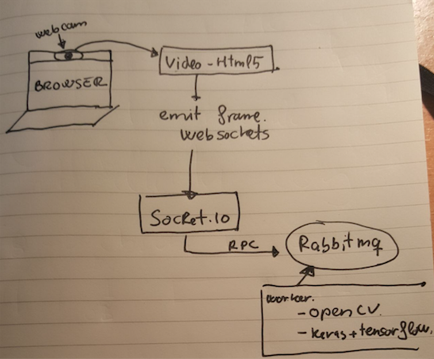

## Happy logins. Only the happy user will pass

Login forms are bored. In this example we're going to create an especial login form. Only for happy users. Happiness is something complicated, but at least, one smile is more easy and all is better with one smile. Our login form will only appear if the user smiles. Let's start.

I must admit that this project is just an excuse to play with different technologies that I wanted to play. Weeks ago I discovered one library called face_classification (https://github.com/oarriaga/face_classification). With this library I can perform emotion classification from a picture. The idea is simple. We create rabbitmq rpc server script that answers with the emotion of the face within a picture. Then we obtain on frame from the video stream of the webcam and we send this frame using websocket to a socket.io server. This websocket server (node) ask to the rabbitmq rpc the emotion and it sends back to the browser the emotion and a the original picture with a rectangle over the face.



### Frontend

As well as we're going to use socket.io for websockets we will use the same script to serve the frontend (the login and the HTML5 video capture)

```html
<!doctype html>
<html>
<head>
    <title>Happy login</title>
    <link rel="stylesheet" href="css/app.css">
</head>
<body>

<div id="login-page" class="login-page">
    <div class="form">
        <h1 id="nonHappy" style="display: block;">Only the happy user will pass</h1>
        <form id="happyForm" class="login-form" style="display: none" onsubmit="return false;">
            <input id="user" type="text" placeholder="username"/>
            <input id="pass" type="password" placeholder="password"/>
            <button id="login">login</button>
            <p></p>
            
        </form>
        <div id="video">
            <video style="display:none;"></video>
            <canvas id="canvas" style="display:none"></canvas>
            <canvas id="canvas-face" width="426" height="320"></canvas>
        </div>
    </div>
</div>

<div id="private" style="display: none;">
    <h1>Private page</h1>
</div>

<script src="https://code.jquery.com/jquery-3.2.1.min.js" integrity="sha256-hwg4gsxgFZhOsEEamdOYGBf13FyQuiTwlAQgxVSNgt4=" crossorigin="anonymous"></script>
<script src="https://unpkg.com/sweetalert/dist/sweetalert.min.js"></script>
<script type="text/javascript" src="/socket.io/socket.io.js"></script>
<script type="text/javascript" src="/js/app.js"></script>
</body>
</html>
```

Here we'll connect to the websocket and we'll emit the webcam frame to the server. We´ll also be listening to one event called 'response' where server will notify us when one emotion has been detected

```js
let socket = io.connect(location.origin),
    img = new Image(),
    canvasFace = document.getElementById('canvas-face'),
    context = canvasFace.getContext('2d'),
    canvas = document.getElementById('canvas'),
    width = 640,
    height = 480,
    delay = 1000,
    jpgQuality = 0.6,
    isHappy = false;

socket.on('response', function (r) {
    let data = JSON.parse(r);
    if (data.length > 0 && data[0].hasOwnProperty('emotion')) {
        if (isHappy === false && data[0]['emotion'] === 'happy') {
            isHappy = true;
            swal({
                title: "Good!",
                text: "All is better with one smile!",
                icon: "success",
                buttons: false,
                timer: 2000,
            });

            $('#nonHappy').hide();
            $('#video').hide();
            $('#happyForm').show();
            $('#smile')[0].src = 'data:image/png;base64,' + data[0].image;
        }

        img.onload = function () {
            context.drawImage(this, 0, 0, canvasFace.width, canvasFace.height);
        };

        img.src = 'data:image/png;base64,' + data[0].image;
    }
});

navigator.getMedia = (navigator.getUserMedia || navigator.webkitGetUserMedia || navigator.mozGetUserMedia);

navigator.getMedia({video: true, audio: false}, (mediaStream) => {
    let video = document.getElementsByTagName('video')[0];
    video.src = window.URL.createObjectURL(mediaStream);
    video.play();
    setInterval(((video) => {
        return function () {
            let context = canvas.getContext('2d');
            canvas.width = width;
            canvas.height = height;
            context.drawImage(video, 0, 0, width, height);
            socket.emit('img', canvas.toDataURL('image/jpeg', jpgQuality));
        }
    })(video), delay)
}, error => console.log(error));

$(() => {
    $('#login').click(() => {
        $('#login-page').hide();
        $('#private').show();
    })
});
```

### Backend
Finally we'll work in the backend. Basically I've check the examples that we can see in face_classification project and tune it a bit according to my needs

```python
from rabbit import builder
import logging
import numpy as np
from keras.models import load_model
from utils.datasets import get_labels
from utils.inference import detect_faces
from utils.inference import draw_text
from utils.inference import draw_bounding_box
from utils.inference import apply_offsets
from utils.inference import load_detection_model
from utils.inference import load_image
from utils.preprocessor import preprocess_input
import cv2
import json
import base64

detection_model_path = 'trained_models/detection_models/haarcascade_frontalface_default.xml'
emotion_model_path = 'trained_models/emotion_models/fer2013_mini_XCEPTION.102-0.66.hdf5'
emotion_labels = get_labels('fer2013')
font = cv2.FONT_HERSHEY_SIMPLEX

# hyper-parameters for bounding boxes shape
emotion_offsets = (20, 40)

# loading models
face_detection = load_detection_model(detection_model_path)
emotion_classifier = load_model(emotion_model_path, compile=False)

# getting input model shapes for inference
emotion_target_size = emotion_classifier.input_shape[1:3]


def format_response(response):
    decoded_json = json.loads(response)
    return "Hello {}".format(decoded_json['name'])


def on_data(data):
    f = open('current.jpg', 'wb')
    f.write(base64.decodebytes(data))
    f.close()
    image_path = "current.jpg"

    out = []
    # loading images
    rgb_image = load_image(image_path, grayscale=False)
    gray_image = load_image(image_path, grayscale=True)
    gray_image = np.squeeze(gray_image)
    gray_image = gray_image.astype('uint8')

    faces = detect_faces(face_detection, gray_image)
    for face_coordinates in faces:
        x1, x2, y1, y2 = apply_offsets(face_coordinates, emotion_offsets)
        gray_face = gray_image[y1:y2, x1:x2]

        try:
            gray_face = cv2.resize(gray_face, (emotion_target_size))
        except:
            continue

        gray_face = preprocess_input(gray_face, True)
        gray_face = np.expand_dims(gray_face, 0)
        gray_face = np.expand_dims(gray_face, -1)
        emotion_label_arg = np.argmax(emotion_classifier.predict(gray_face))
        emotion_text = emotion_labels[emotion_label_arg]
        color = (0, 0, 255)

        draw_bounding_box(face_coordinates, rgb_image, color)
        draw_text(face_coordinates, rgb_image, emotion_text, color, 0, -50, 1, 2)
        bgr_image = cv2.cvtColor(rgb_image, cv2.COLOR_RGB2BGR)

        cv2.imwrite('predicted.png', bgr_image)
        data = open('predicted.png', 'rb').read()
        encoded = base64.encodebytes(data).decode('utf-8')
        out.append({
            'image': encoded,
            'emotion': emotion_text,
        })

    return out

logging.basicConfig(level=logging.WARN)
rpc = builder.rpc("image.check", {'host': 'localhost', 'port': 5672})
rpc.server(on_data)
```

Here you can see in action the working prototype

[](https://www.youtube.com/watch?v=SFCiz9GlhTw)

Maybe we can do the same with another tools and even more simple but as I said before this example is just an excuse to play with those technologies:
* Send webcam frames via websockets
* connect one node application to a Pyhon application via RabbitMQ RPC
* Play with face classification script

Please don't use this script in production. It's just a proof of concepts.